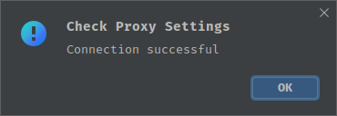

# Chainsaw Installation

Owner: Ricardo Lee
Created time: August 5, 2023 11:47 PM
Status: In progress

# Installation(via Intellij IDEA)

- 可以通过两种方式来创建所需要的project
    - 方式一: 通过IDEA的Get from VCS功能
        
        
        
        或者使用git clone来打开本项目
        
        ```bash
        git clone git@github.com:Chainsaw-Team/ChainsawTemplate.git [targetDir]
        ```
        
    - 方式二: 通过本项目的sbt文件构建一个Scala项目: <your_project>
        - 如何修改sbt定制你的项目
            - 项目的版本号 ⇒ 修改version的值
            - scala的版本号 ⇒ 修改scalaVersion的值, 这里我们固定使用2.12.16, 因为我们导入的jar包的scala版本是2.12.16
            - 组织信息 ⇒ 修改organization的值
            - SpinalHDL版本 ⇒ 修改SpinalHDLVersion, 这里我们统一使用1.7.2
            - 各个import的package的版本修改 ⇒ 可以修改最后一个%之后的版本号来import不同的package版本
            - 项目的名称 ⇒ 通过修改ProjectConfig的name字段来修改项目的名称
- download .jar file to lib file
    - 在正式编译ChainsawTemplate或新创建的<your_project>之前, 需要前往[ChainsawTeam/Chainsaw](https://github.com/Chainsaw-Team/Chainsaw)下载[Releases](https://github.com/Chainsaw-Team/Chainsaw/releases)版本的jar文件
        - Chainsaw.jar
        - engine.jar
    - 下载完成之后将其放到ChainsawTemplate/lib或<your_project>/lib这个目录下(如果识别不到, 在对应的jar文件下右键→ Add as Library)
    - 若是通过新建project的方式引用Chainsaw, 需要在项目中新建一个config.yaml文件, 具体的文件内容参考ChainsawTemplate或者下载realease版本中的config.yaml放到项目中
- build
    - sbt文件放在/ChainsawTemplate/build.sbt
    - 上述步骤完成之后, 就可以开始ChainsawTemplate/<your_project>的编译过程了, 编译的时候最好有[梯子](https://www.notion.so/Chainsaw-Installation-37594125abe1453fb736d41854cd2d4e?pvs=21)
    

# For Mainland China

- 在第一次编译ChainsawTemplate时,需要下载sbt,scala和其它依赖项,此时最好有梯子,下面给出在使用clash + Intellij IDEA时的代理配置方法
    - 在clash的General页面中查看端口号,使用WSL时,还需要开启Allow LAN,将鼠标悬停在该选项上,可以查看到相对于WSL的host ip
        
        
        
    - 在IDEA的Settings中设置host ip和端口号,check connection无误后配置完成
        - host ip一般是127.0.0.1(localhost),对于WSL,使用上面查看到的IP
        
        
        
        
        
    

# Run example in Chainsaw by ChainsawTemplate

## HelloChainsaw

- 演示了导入Chainsaw之后如何import, 可用于导入jar文件后的测试

## Hello<Package>

- 演示了如何使用Chainsaw的各种package, 具体的package tree见[Chainsaw](https://github.com/Chainsaw-Team/Chainsaw)
